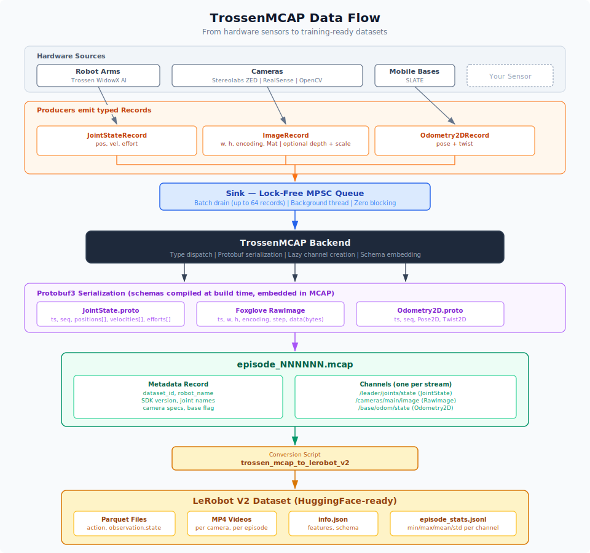
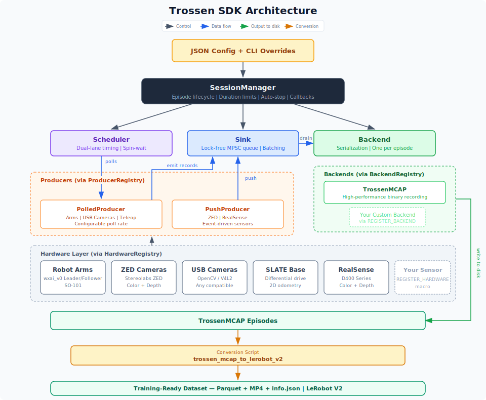
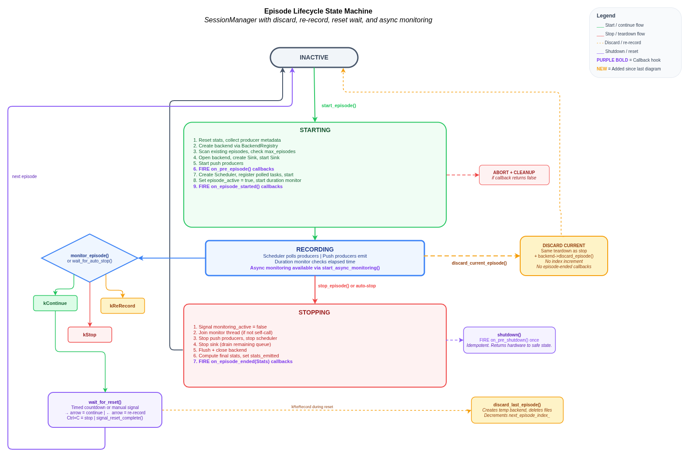

# Trossen SDK

A C++ SDK for recording robot demonstrations with Trossen AI Kit arms, Stereolabs ZED cameras, RealSense cameras, and the SLATE mobile base. Episodes are recorded to the **TrossenMCAP** format and can be converted to **LeRobot V2** format for training.

---

## Table of Contents

- [Features](#features)
- [Data Flow Overview](#data-flow-overview)
- [Recommended Workflow](#recommended-workflow)
- [Supported Hardware](#supported-hardware)
- [Installation](#installation)
- [Building](#building)
- [Quick Start](#quick-start)
- [Desktop App (no CLI)](#desktop-app-no-cli)
- [Interactive Episode Controls](#interactive-episode-controls)
- [Configuration Reference](#configuration-reference)
- [Converting to LeRobot V2](#converting-to-lerobot-v2)
- [Architecture Overview](#architecture-overview)
- [Extending the SDK](#extending-the-sdk)
- [Further Reading](#further-reading)

---

## Features

- Record synchronized episodes from arms, cameras, and a mobile base to a single `.mcap` file per episode
- Config-driven setup: one JSON file describes all hardware, producers, and session parameters
- CLI overrides via `--set key=value` dot-notation for quick iteration without editing JSON
- Automatic episode numbering with resumption from existing episodes in the output directory
- Joint states recordable up to 200 Hz; cameras at configurable frame rates
- Converts recorded TrossenMCAP files to LeRobot V2 format (Parquet + MP4 video) with per-episode statistics computed during conversion
- Interactive episode controls: re-record, skip, and discard episodes with keyboard shortcuts during recording
- Audio announcements via text-to-speech for hands-free session feedback
- Configurable reset duration between episodes (countdown, skip, or wait for input)


---

## Data Flow Overview

The diagram below shows how sensor data flows through the SDK — from hardware devices through producers and the lock-free sink into TrossenMCAP episode files, and finally through the conversion tool into training-ready LeRobot V2 datasets.

<p align="center">
  
</p>

---

## Recommended Workflow

```
Record demonstrations           Convert to training format
─────────────────────────       ─────────────────────────────────────────────
Run example script          →   trossen_mcap_to_lerobot_v2 <input> <output>
  ↓ episode_000000.mcap              ↓ Parquet + MP4 per episode
  ↓ episode_000001.mcap              ↓ info.json with per-episode statistics
  ↓ ...
```

1. Choose the example that matches your robot setup (solo, stationary, or mobile)
2. Edit `config.json` to match your hardware (IP addresses, camera serial numbers, episode duration)
3. Run the recording script to collect `.mcap` episode files
4. Run the conversion tool to produce a LeRobot V2 dataset

---

## Supported Hardware

| Hardware | Type string | Description |
|---|---|---|
| Trossen AI Kit arm | `trossen_arm` | wxai_v0 arms (leader and follower) |
| Stereolabs ZED camera | `zed_camera` | Stereo camera — Color + Depth (Jetson only, requires GMSL) |
| RealSense camera | `realsense_camera` | Depth camera — RGB stream only (see note below) |
| OpenCV / USB camera | `opencv_camera` | Any V4L2-compatible USB camera |
| SLATE mobile base | `slate_base` | Differential drive base with odometry |

> **Note:** RealSense depth capture is supported alongside RGB, but requires careful hardware setup to get the best results. Enabling depth significantly increases USB bandwidth usage, which can introduce frame drops if the bus is saturated.
>
> **Multi-camera USB bandwidth:** When running multiple RealSense cameras, USB 3.0 bus bandwidth is the primary bottleneck. Each camera's bandwidth scales with resolution, frame rate, and number of active streams. To avoid frame drops and instability:
> - Use short (under 1 m), high-quality shielded USB 3.0 cables — for longer runs, use active USB 3.0 repeaters instead of passive extensions
> - Distribute cameras across independent USB host controllers — multiple ports on the same bus share bandwidth
> - Reduce resolution and frame rate per camera as the camera count increases (e.g. 4 cameras at 640x360 @ 30 fps fits within a single bus; 4 cameras at 1280x720 @ 30 fps does not)
> - Use externally powered USB hubs — each RealSense camera draws around 2 W, which exceeds per-port bus power when running multiple cameras
>
> See the [RealSense multi-camera configuration guide](https://dev.realsenseai.com/docs/multiple-depth-cameras-configuration) for detailed bandwidth calculations and tested configurations.

### Data modalities recorded

- **Joint states** — position, velocity, and effort for each arm at up to 200 Hz
- **Camera images** — BGR8 frames at configurable resolution and frame rate
- **Mobile base odometry** — 2D velocity (vx, vy, wz) from the SLATE base

---

## Installation

### System dependencies

```bash
sudo apt-get update
sudo apt-get install -y \
    build-essential \
    cmake \
    libopencv-dev \
    libprotobuf-dev \
    protobuf-compiler \
    ffmpeg
```

### Apache Parquet

In order to read and write Parquet files, you need to install the Apache Parquet C++ library. You can do this by adding the Apache Arrow APT repository and installing the necessary packages. This was tested on Ubuntu 24.04.

```bash
sudo apt update
sudo apt install -y -V ca-certificates lsb-release wget
wget -P /tmp https://packages.apache.org/artifactory/arrow/$(lsb_release --id --short | tr 'A-Z' 'a-z')/apache-arrow-apt-source-latest-$(lsb_release --codename --short).deb
sudo apt install -y -V /tmp/apache-arrow-apt-source-latest-$(lsb_release --codename --short).deb
rm /tmp/apache-arrow-apt-source-latest-$(lsb_release --codename --short).deb
sudo apt update
sudo apt install -y -V \
    libarrow-dev \
    libarrow-glib-dev \
    libarrow-dataset-dev \
    libarrow-dataset-glib-dev \
    libarrow-acero-dev \
    libarrow-flight-dev \
    libarrow-flight-glib-dev \
    libarrow-flight-sql-dev \
    libarrow-flight-sql-glib-dev \
    libgandiva-dev \
    libgandiva-glib-dev \
    libparquet-dev \
    libparquet-glib-dev
```

### Trossen Arm library

Install `libtrossen_arm` by following the C++ setup guide in the Trossen Robotics documentation:

[https://docs.trossenrobotics.com/trossen_arm/main/getting_started/software_setup.html#c](https://docs.trossenrobotics.com/trossen_arm/main/getting_started/software_setup.html#c)

The library must be installed before building this SDK.

### Stereolabs ZED (Jetson only)

Required for Stereolabs ZED cameras. ZED cameras use GMSL connectors and are supported on NVIDIA Jetson platforms only. Install the ZED SDK by following the [official installation guide](https://www.stereolabs.com/docs/development/zed-sdk/linux).

### RealSense

Required for RealSense cameras. Install the RealSense SDK 2.0 by following the [official installation guide](https://github.com/IntelRealSense/librealsense/blob/master/doc/distribution_linux.md).

---

## Building

Examples and the conversion script are always included in the build.

### Standard build

### Building with Stereolabs ZED support (Jetson only)

ZED camera support is disabled by default. To enable it on a Jetson platform:

```bash
cmake .. -DTROSSEN_ENABLE_ZED=ON
make -j$(nproc)
```

### Standard build (RealSense)

RealSense support is **enabled by default**. The standard build includes it automatically:

```bash
mkdir -p build
cd build
cmake ..
make -j$(nproc)
```

---

## Quick Start

Three example scripts cover the main robot configurations. Each has its own README with setup details:

| Example | Description | Guide |
|---|---|---|
| `examples/trossen_solo_ai/` | Single leader + follower arm pair + 2 cameras | [Solo Guide](examples/trossen_solo_ai/README.md) |
| `examples/trossen_stationary_ai/` | Bimanual (2 leader + 2 follower) + 4 cameras | [Stationary Guide](examples/trossen_stationary_ai/README.md) |
| `examples/trossen_mobile_ai/` | Bimanual + SLATE mobile base + 3 cameras | [Mobile Guide](examples/trossen_mobile_ai/README.md) |

All examples follow the same pattern:

```bash
# Run with default config
./build/examples/trossen_solo_ai

# Override a value at the command line without editing JSON
./build/examples/trossen_solo_ai --set hardware.arms.leader.ip_address=192.168.1.10

# Inspect the merged config without running
./build/examples/trossen_solo_ai --dump-config
```

Episodes are saved to the directory set in `backend.root` (default: `~/.trossen_sdk/<dataset_id>/`).

> The example scripts are starting points. The [Architecture Overview](#architecture-overview) section below explains how to write your own recording script or extend the SDK with new hardware.

---

## Desktop App (no CLI)

If you prefer a graphical interface to the CLI tooling above, the repo
ships an Electron-based desktop app for recording sessions, browsing
datasets, and converting MCAP → LeRobot V2 — all without writing config
files or running uvicorn manually. It packages as a single Linux
`AppImage`.

See [`webapp/README.md`](webapp/README.md) for build and use instructions.

---

## Interactive Episode Controls

During a recording session the operator can control episode flow using keyboard shortcuts. No mouse or GUI is needed — this is designed for hands-free data collection with audio feedback.

### Keyboard shortcuts

| Phase | Key | Action |
|---|---|---|
| **Recording** | Left arrow | Discard current episode and re-record at the same index |
| **Recording** | Right arrow | Stop recording early and proceed to reset |
| **Recording** | Ctrl+C | End the session |
| **Reset** | Left arrow | Discard the last completed episode and re-record |
| **Reset** | Right arrow | Continue to next episode (skip countdown / end wait) |
| **Reset** | Ctrl+C | End the session |

### Reset duration

The pause between episodes is controlled by `session.reset_duration` in the config JSON:

| Value | Behavior |
|---|---|
| Positive number (e.g. `5.0`) | Countdown for that many seconds, then start next episode |
| `0` | No pause — start the next episode immediately |
| Omitted / `null` | Wait indefinitely until the operator presses right arrow |

### Audio announcements

The SDK announces session events via text-to-speech using `spd-say`. Install it for audio cues:

```bash
sudo apt-get install -y speech-dispatcher
```

Events announced: "Episode N started", "Episode N complete", "Reset time". If `spd-say` is not installed, announcements are silently skipped.

### Custom input methods

The keyboard controls in the examples are just one way to drive the session. The SessionManager exposes callbacks and thread-safe methods that let you plug in any input source — a GUI, a foot pedal, a web dashboard, ROS topics, etc.

**Lifecycle callbacks** let you react to episode events:

| Callback | When it fires | Typical use |
|---|---|---|
| `on_pre_episode(cb)` | Before recording starts (can abort) | Validate hardware state, move arm to start pose |
| `on_episode_started(cb)` | After recording begins | Update UI, enable teleop |
| `on_episode_ended(cb)` | After episode is saved | Log stats, trigger post-processing |
| `on_pre_shutdown(cb)` | During `shutdown()`, after recording stops | Return arms to sleep position |

**Control methods** for driving the session programmatically:

| Method | Thread-safe | Effect |
|---|---|---|
| `request_rerecord()` | Yes | Signals `monitor_episode()` to exit with `UserAction::kReRecord` |
| `signal_reset_complete()` | Yes | Wakes `wait_for_reset()` to proceed to the next episode |
| `stop_episode()` | No | Stops recording immediately |
| `discard_current_episode()` | No | Stops and deletes the current episode |
| `discard_last_episode()` | No | Deletes the most recently completed episode |

For example, a web UI could call `request_rerecord()` when the user clicks a "discard" button, or `signal_reset_complete()` when they click "next episode" — no keyboard required.

---

## Configuration Reference

All examples share the same JSON config schema. Key sections:

```jsonc
{
  "robot_name": "my_robot",          // Identifier used in dataset metadata

  "hardware": {
    "arms": {                        // Map of arm ID → arm config
      "leader": {
        "ip_address": "192.168.1.2",
        "model": "wxai_v0",
        "end_effector": "wxai_v0_leader"
      },
      "follower": {
        "ip_address": "192.168.1.4",
        "model": "wxai_v0",
        "end_effector": "wxai_v0_follower"
      }
    },
    "cameras": [                     // Array of camera configs
      {
        "id": "camera_main",
        "serial_number": "128422271347",
        "width": 640,
        "height": 480,
        "fps": 30
      }
    ]
    // "mobile_base": { ... }        // Include for the mobile example only
  },

  "producers": [                     // Array — one entry per data stream
    {
      "type": "trossen_arm",         // Hardware type string
      "hardware_id": "leader",       // Must match a key in hardware.arms
      "stream_id": "leader",         // Name used inside the MCAP file
      "poll_rate_hz": 30.0,          // Supports up to 200 Hz for arms
      "use_device_time": false
    },
    {
      "type": "realsense_camera",
      "hardware_id": "camera_main",  // Must match an id in hardware.cameras
      "stream_id": "camera_main",
      "poll_rate_hz": 30.0,
      "encoding": "bgr8",            // RGB only — depth not recommended
      "use_device_time": true
    }
  ],

  "teleop": {                        // Teleoperation — required for leader/follower setups
    "enabled": true,
    "rate_hz": 1000.0,
    "pairs": [
      { "leader": "leader", "follower": "follower" }
    ]
  },

  "backend": {                       // TrossenMCAP backend settings
    "root": "~/.trossen_sdk",        // Directory where episode files are written
    "dataset_id": "my_dataset",      // Sub-directory name for this dataset
    "compression": "",               // "" | "lz4" | "zstd"
    "chunk_size_bytes": 4194304      // MCAP chunk size (4 MB default)
  },

  "session": {
    "max_duration": 20.0,            // Episode length in seconds — always set a limit
    "max_episodes": 50,              // Total episodes to record — always set a limit
    "backend_type": "trossen_mcap",  // The recommended backend
    "reset_duration": 5.0            // Seconds between episodes (0 = skip, omit = wait for input)
  }
}
```

> Always set both `max_duration` and `max_episodes`. Running without limits requires manual Ctrl+C to stop each episode and risks inconsistent dataset sizes.

### CLI overrides

Any JSON key can be overridden at runtime using dot-notation:

```bash
./build/examples/trossen_solo_ai \
  --set hardware.arms.leader.ip_address=192.168.1.2 \
  --set session.max_duration=30 \
  --set backend.dataset_id=trial_01
```

---

## Converting to LeRobot V2

After recording, convert your `.mcap` episodes to LeRobot V2 format:

```bash
# Convert a single episode
./build/scripts/trossen_mcap_to_lerobot_v2 ~/.trossen_sdk/my_dataset/episode_000000.mcap ~/lerobot_datasets

# Convert all episodes in a folder (batch mode)
./build/scripts/trossen_mcap_to_lerobot_v2 ~/.trossen_sdk/my_dataset/ ~/lerobot_datasets
```

The tool produces a dataset compatible with the LeRobot training framework, including per-episode statistics (min/max/mean/std for all joint streams and image statistics):

```
lerobot_datasets/
└── trossen_robotics/
    └── my_dataset/
        ├── meta/
        │   ├── info.json                    # Dataset statistics and feature descriptions
        │   ├── episodes.jsonl               # Per-episode metadata
        │   └── tasks.jsonl                  # Task descriptions
        ├── data/
        │   └── chunk-000/
        │       └── episode_000000.parquet   # Joint state data in columnar format
        └── videos/
            └── chunk-000/
                └── observation.images.camera_main/
                    └── episode_000000.mp4
```

For full conversion options and format details see the [Conversion Tool Guide](scripts/trossen_mcap_to_lerobot_v2/README.md).

---

## Architecture Overview

<p align="center">
  
</p>

The SDK is built around five cooperating components: **HardwareComponent** wraps a physical device, **Producer** polls hardware and emits records, **Sink** queues records via a lock-free MPSC queue, **Backend** serializes to disk, and **Scheduler** drives polling at configured rates. **SessionManager** creates and tears down a fresh Scheduler + Sink + Backend for every episode.

### Key abstractions

**HardwareComponent** wraps a single physical device. Accepts a JSON config block and provides typed access to the driver (joint API, camera frame API, etc.).

**PolledProducer** reads from a HardwareComponent and emits `Record` objects. The Scheduler
calls `poll(emit)` at a fixed period. Each record carries a stream `id`, a monotonic `seq`
counter, and a dual `Timestamp`.

**Record types:**

| Type | Fields | Hardware |
|---|---|---|
| `JointStateRecord` | positions (rad), velocities (rad/s), efforts (Nm) | Trossen arm, SO101 arm |
| `ImageRecord` | width, height, encoding, pixel data | Cameras |
| `Odometry2DRecord` | pose (m, rad), velocity (m/s, rad/s) | SLATE base |

**Timestamp** — every record carries both a monotonic clock (`CLOCK_MONOTONIC`, for replay
ordering) and a realtime clock (UTC, for wall-time correlation), both at nanosecond
resolution.

**Sink** — owns a lock-free MPSC queue and a background drain thread. Producers enqueue
records non-blocking; the drain thread batches up to 64 records per iteration and calls
`backend->write_batch()`. Disk latency never stalls producer polling.

**Backend** — serialises a batch of records to storage. One Backend instance per episode;
`session.backend_type` selects which implementation to use via the BackendRegistry.

### Episode lifecycle

<p align="center">
  
</p>

The SessionManager moves each episode through startup, recording, and stopping phases before returning to an inactive state for the next episode. Applications can hook into the documented lifecycle callback points: pre-episode, episode-started, episode-ended, and pre-shutdown.

```
start_episode()
  1. Instantiate Backend (BackendRegistry)
  2. Create Sink (starts drain thread, opens backend file)
  3. Start push producers
  4. Fire pre-episode callbacks (can abort episode)
  5. Create Scheduler; register one polling task per producer
  6. Start duration monitor thread (if max_duration set)
  7. Fire episode-started callbacks

  --- recording in progress ---

stop_episode()
  1. Signal and join monitor thread
  2. Stop push producers
  3. Stop Scheduler (producers stop polling)
  4. Stop Sink (drain remaining queue, flush and close backend)
  5. Update state and increment episode index
  6. Fire episode-ended callbacks

discard_current_episode()
  Same teardown as stop_episode(), but deletes all episode files
  and does NOT increment the episode index or fire callbacks.

discard_last_episode()
  Deletes files for the most recently completed episode and
  decrements the episode index so the next episode reuses it.

wait_for_reset()
  Pauses between episodes for the configured reset_duration.
  Returns a UserAction indicating what the operator chose.
```

`monitor_episode()` blocks while recording and returns a `UserAction` — **kContinue** (episode completed normally), **kReRecord** (operator wants to discard and retry), or **kStop** (Ctrl+C). The re-record path calls `discard_current_episode()` which tears down the episode and deletes its files without advancing the episode index. Between episodes, `wait_for_reset()` provides a configurable pause with the same three-way `UserAction` return, allowing the operator to discard the *last completed* episode via `discard_last_episode()`.

Each episode gets its own Backend file handle, Sink queue, and Scheduler — no state is
shared between episodes.

**Configuration split — `backend` vs `session.backend_type`:**
The `backend` section holds TrossenMCAP-specific settings (output path, compression, chunk
size). `session.backend_type` tells the SessionManager which backend class to instantiate.
This keeps lifecycle settings (`session`) separate from format parameters (`backend`).

---

## Extending the SDK

The SDK is designed to be extended. You can add support for new hardware devices or new data types without modifying the core library.

- **Custom hardware component** — implement `HardwareComponent` and register with `REGISTER_HARDWARE`
- **Custom producer** — implement `PolledProducer` and register with `REGISTER_PRODUCER`

The key headers are:
- [`include/trossen_sdk/hw/hardware_component.hpp`](include/trossen_sdk/hw/hardware_component.hpp) — base class for hardware
- [`include/trossen_sdk/hw/hardware_registry.hpp`](include/trossen_sdk/hw/hardware_registry.hpp) — `REGISTER_HARDWARE` macro
- [`include/trossen_sdk/hw/producer_base.hpp`](include/trossen_sdk/hw/producer_base.hpp) — `PolledProducer` base class
- [`include/trossen_sdk/runtime/producer_registry.hpp`](include/trossen_sdk/runtime/producer_registry.hpp) — `REGISTER_PRODUCER` macro
- [`include/trossen_sdk/runtime/session_manager.hpp`](include/trossen_sdk/runtime/session_manager.hpp) — episode lifecycle API

See the example scripts in `examples/` for complete, working implementations of hardware setup and episode recording loops.

---

## Further Reading

| Document | Contents |
|---|---|
| [Conversion Tool Guide](scripts/trossen_mcap_to_lerobot_v2/README.md) | Conversion usage, TrossenMCAP channel/schema reference, LeRobot V2 Parquet/metadata schema |
| [Replay Tool Guide](scripts/replay_trossen_mcap_jointstate/README.md) | Replaying recorded episodes on hardware |
| [Solo Example Guide](examples/trossen_solo_ai/README.md) | Hardware setup and recording for the solo AI kit |
| [Stationary Example Guide](examples/trossen_stationary_ai/README.md) | Bimanual stationary setup |
| [Mobile Example Guide](examples/trossen_mobile_ai/README.md) | Bimanual + SLATE mobile base setup |
