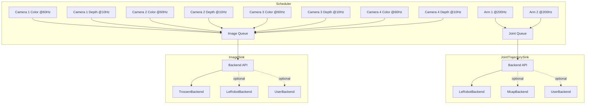

# Trossen SDK V2 Design Document

## Overview

This SDK logs synchronized robotics data such as joint trajectories and camera frames.
It uses a central event loop scheduler to trigger periodic callbacks and sink threads to handle I/O.
Each sink delegates persistence to a pluggable backend (e.g., MCAP, LeRobot, Trossen, or user-defined).
This design allows users to create extremely-high throughput and data intensive datasets with minimal CPU and memory overhead.
It focuses on precise timing, low latency, and flexibility.

## Target Use Case

Target configuration and performance:

- 2x robotic arms with joint states logged at ~200 Hz each
- Up to 4x cameras with 1080p color frames logged at ~60 Hz each and 480p depth frames logged at ~30 Hz each

## Time Model

Each recorded sample carries two timestamps:

- `monotonic_ns`

  - Nanoseconds from the monotonic clock.
  - Stable for relative timing and replay.

- `realtime_ns`

  - Nanoseconds from the realtime (wall) clock (UTC).
  - Used for correlating across machines and external logs.

Together, these allow deterministic replay and global correlation.

## Architecture

### Components

- **Scheduler**

  - Runs in one dedicated thread.
  - Executes periodic callbacks at requested rates.
  - Handles tasks like pulling data from device drivers.

- **Sinks (pluggable)**

  - Run in their own worker thread.
  - Buffer records in a queue and forward them to a backend.
  - Example sinks:

    - `JointTrajectorySink`
    - `ImageSink`

- **Backends (pluggable)**

  - Define how data is serialized and stored.
  - Example backends:

    - `TrossenBackend` - Log data to Trossen format
    - `McapBackend` - Log data to MCAP files
    - `LeRobotBackend` - Log data to LeRobot datasets format
    - `UserBackend` - Log data to user-defined format

## Data Flow



## Storage Semantics

This SDK treats all persisted data as an append-only log segmented by their dedicated sink.

### Ordering Guarantees

- Per-sink record order equals enqueue order; enforced by single-consumer drain thread.
- Cross-sink ordering is not globally serialized. Consumers should use the `monotonic_ns` timestamp for temporal correlation.
- Sequence numbers (`seq`) are strictly increasing per sink.

### Batching

- Drain loop aggregates up to N records (e.g., 64) per write call to reduce the number of system calls and compression overhead.

### Compression & Encoding

- Pluggable backends decide encoding.
- Compression strategies (PNG, LZ4, Zstd) typically operate on chunked batches aligned with time or size thresholds.

### Deletion / Mutability

- Design intentionally omits in-place mutation; any derived dataset should be produced via transformation pipelines.

## Concurrency Model & MPSC Queues

High-frequency producers (arms, cameras) concurrently enqueue into per-sink MPSC queues. Each sink has exactly one consumer thread.

### Rationale

- Avoids lock contention of multi-consumer designs.
- Enables predictable latency: producers only contend for cache lines in the ring buffer.
- Single consumer permits batch pops with minimal synchronization (e.g., reading a monotonic tail pointer snapshot).

### Queue Implementation Options

We standardize initially on ``moodycamel::ConcurrentQueue``: fast, header-only, widely used, and future-proof if we later move from MPSC to MPMC.
A thin adapter wrapper will let us swap implementations without touching sink logic.

### Memory Layout

Goal: keep logging fast without wasting memory.

- Big / unpredictable data (e.g., images) is not copied into the queue.
  Instead the queue only holds a tiny handle (a pointer) to where the bytes live.
  That keeps the queue light and quick to write to.
- Small, fixed-size data (e.g., joint states) can come from a pre-reserved block of equally sized slots.
- We reuse those slots instead of asking the system for fresh memory every time.

Why this helps:

- Less copying of large blobs → lower CPU use.
- Reuse of slots → fewer hiccups from the memory allocator.
- Predictable layout → more consistent latency under heavy load.

### Backpressure Strategies

| Strategy | Description                                  | Pros                | Cons                                                       |
|----------|----------------------------------------------|---------------------|------------------------------------------------------------|
| Drop New | Reject incoming record                       | Constant latency    | Data loss under burst                                      |
| Drop Old | Overwrite oldest                             | Keeps freshest data | Complexity + potential reordering semantics if not careful |
| Block    | Producer spins/parks                         | No loss             | Risk of priority inversion / jitter                        |
| Spill    | Overflow to slower storage (e.g., mmap file) | Resilience          | Added complexity & latency                                 |

Default approach: Drop newest with metrics emission (dropped count) so upstream can tune rates or queue depth.

### Drain Loop Timing

- Hybrid wait: spin (N iterations) → yield → `sleep_for( microseconds )` to balance latency vs. CPU.
- Optionally integrate eventfd / futex style notification to wake consumer on transitions from empty→non-empty.

### Per-Sink / Per-Backend Strategy Profiles

Different data streams benefit from different tuning. We support assigning a profile at sink creation (and optionally letting the backend refine encoding/compression per type).

| Profile | Example Streams | Queue Policy | Drain Timing | Batch Target | Compression | Notes |
|---------|-----------------|--------------|-------------|--------------|-------------|-------|
| HighFrequencySmall | Joint states @200 Hz | Drop New (metrics) | Short spin (128) → yield → 50µs cap | 32–64 records | Usually off (data tiny) | Prioritize latency; small batch keeps replay alignment tight |
| HighPayloadMediumRate | 1080p color @60 Hz | Block briefly then Drop New | Spin (32) → yield → 100µs cap | 1–4 frames or 4MB | Lossless (PNG) or fast (LZ4) | Avoid large latency spikes; coalesce only a few frames |
| LowRateLargePayload | Depth frames @10–30 Hz | Block (bounded wait) | Minimal spin (16) → sleep 200µs | 1–2 frames | Stronger compression (Zstd) | Idle-friendly; trade a little latency for CPU savings |
| BurstyMeta | Calibration / events | Drop New or Block | Event-driven (no spin) | Flush immediately | Off | Rare events—prefer simplicity |

Implementation knobs (per sink):
- `spin_iterations_max`
- `sleep_us_cap`
- `batch_record_limit`
- `batch_byte_limit`
- `backpressure_mode` (enum)
- `enable_event_wake` (bool)

Per-backend overrides:
- `compression_kind` (none | lz4 | zstd | png | auto)
- `compression_level` / speed vs. ratio trade-off
- `partition_size_mb` / `partition_duration_s`
- `checksum_mode` (none | chunk | file)

Adaptive option: Sink can promote from HighFrequencySmall → HighPayloadMediumRate behavior automatically if observed average payload bytes/record crosses a threshold for sustained period.

Minimal C++ sketch of profile application:

```cpp
struct SinkProfile {
    uint32_t spin_max;
    uint32_t sleep_us_cap;
    uint32_t batch_records;
    uint32_t batch_bytes;
    BackpressureMode backpressure;
    bool event_wake;
};

SinkProfile HighFrequencySmall(){ return {128, 50, 64, 64*1024, BackpressureMode::DropNew, false}; }
SinkProfile HighPayloadMediumRate(){ return {32, 100, 8, 4*1024*1024, BackpressureMode::BlockThenDrop, true}; }
```

### Thread Affinity

- Pin sink threads to isolated cores to reduce context switches and L1 eviction for hot producers.
- Allow user override via configuration (CPU sets / scheduling policy RT vs. normal timeslice).

### Memory Fences

- Acquire on consumer pop, release on producer push ensures visibility without full fences.
- Avoid unnecessary seq_cst atomics unless ordering across unrelated queues is required (rare).

## Data Model

### Timestamp

```cpp
struct Timestamp {
    uint64_t monotonic_ns; // Stable monotonic clock for ordering & replay
    uint64_t realtime_ns;  // Wall-clock (UTC) for cross-system correlation
};
```

### Record Hierarchy

All persisted entities derive from `RecordBase`. The base captures fields common to every record:

```cpp
struct RecordBase {
  // Timing info
  Timestamp ts;

  // Sequential counter for each source
  uint64_t seq;

  // Stream identifier (e.g., "follower_left")
  std::string id;
};

// Joint state payload (fixed-size small vector possible in production)
struct JointStateRecord : public RecordBase {
  std::vector<float> positions; // size = DOF
  std::vector<float> velocities;
  std::vector<float> efforts;
};

// Image payload (simplified). Real design might use owning/shared buffer with stride & encoding.
struct ImageRecord : public RecordBase {
  uint32_t width;
  uint32_t height;

  // 1=gray,3=RGB,4=RGBA
  uint32_t channels;

  // Image encoding e.g. "rgb8", "bgr8", "mono8"
  std::string encoding;

  // Image data - shared to allow zero-copy fan-out
  std::shared_ptr<std::vector<uint8_t>> data;
};

// User-defined example
struct UserCustomRecord : public RecordBase {
  ...
};
```

### Memory Management Options

| Strategy | Description | Pros | Cons |
|----------|-------------|------|------|
| Shared Ptr Buffers | Image bytes shared across sinks/backends | Zero-copy fan-out | Ref-count overhead |
| Slab + Indices | Pre-allocated slabs; queue stores indices | Predictable latency | Complexity, fixed upper bounds |
| Arena per Batch | Allocate batch lifetime, encode then free | Low fragmentation | Batch lifetime coupling |

## Hardware Producers (Wrappers)

### Goals

Provide a unified, low-latency API for polling / streaming hardware sources (robots, cameras) into the logging pipeline as typed `RecordBase` derivatives while:

- Preserving highest fidelity timing (prefer device / driver monotonic time if exposed).
- Avoiding unnecessary data copies (zero-copy handoff for image buffers; shallow conversion for joint arrays).
- Allowing both pull (scheduler-driven periodic poll) and push (device callback / capture thread) models.
- Keeping hardware-specific code isolated from sinks/backends so new devices can be added modularly.

### Categories

1. Robot Producers (e.g., Trossen Arm)
   - Emit `JointStateRecord` at a deterministic rate (configured Hz).
   - Provide sequence numbering (internal counter) and mapping from driver joint order to record order.
   - Optionally expose latency metrics (driver timestamp vs SDK monotonic snapshot).

2. Camera Producers (OpenCV initial implementation)
   - Color-only (RGB/BGR) or Color + Depth (future extension).
   - May run at independent frame rate(s) for color and depth.
   - Provide per-frame device timestamp if available (V4L2, camera intrinsic clock); fallback to SDK `now_mono_ns()`.
   - Convert pixel format into standard encodings ("rgb8", "bgr8", etc.).

### Core Interfaces

```cpp
namespace trossen::hw {

class PolledProducer {
public:
  virtual ~PolledProducer() = default;
  virtual void poll(const std::function<void(std::shared_ptr<data::RecordBase>)>& emit) = 0;
};

class PushProducer {
public:
  virtual ~PushProducer() = default;
  virtual void start(const std::function<void(std::shared_ptr<data::RecordBase>)>& emit) = 0;
  virtual void stop() = 0;
};

} // namespace trossen::hw
```

### Trossen Arm Producer (Robot)

`TrossenArmProducer` (polled):
- Params: driver ref, stream id, dof, optional transform functor.
- Steps: read driver -> timestamp -> convert doubles -> fill record -> emit.
- Metrics: produced, jitter, convert time.

### OpenCV Camera Producer

`OpenCvCameraProducer` (push thread): open device, capture loop, convert frame, timestamp, emit.
Depth extension later via secondary capture or composite record.

### Realsense Camera Producer

`RealsenseCameraProducer` (polled, color) and `RealsenseDepthCameraProducer` (polled, depth) share a **single RealSense pipeline** via a synchronized **frame cache**, allowing each producer to emit **one image record per poll** while guaranteeing color–depth frames originate from the **same frameset**.
This design avoids concurrent `wait_for_frames()` calls, preserves existing producer semantics, and ensures deterministic multi-stream synchronization (see [Realsense Frame Cache Design](./hardware/REALSENSE_CAMERA.md) for details).


### Timestamp Strategy

Priority: hardware monotonic > driver capture time > SDK monotonic.

### Directory / Namespace

```
include/trossen_sdk/hw/
  producer_base.hpp
  arm/arm_producer.hpp
  camera/opencv_producer.hpp
src/hw/arm/arm_producer.cpp
src/hw/camera/opencv_producer.cpp
```

Namespaces: `trossen::hw`, `trossen::hw::arm`, `trossen::hw::camera`.

### Future
- GPU camera path, calibration records, adaptive polling.
