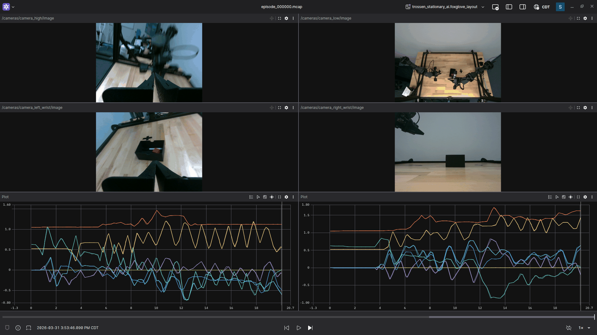

=========
Visualize
=========

The SDK supports two visualization workflows:

-   **Post-hoc inspection in Foxglove Studio.**
    Open any recorded ``.mcap`` file after the session finishes.
    No build-time configuration is required.
-   **Live streaming to a ReRun viewer during recording.**
    Plots and camera feeds update in real time as the operator teleoperates.
    Requires a build-time flag and a small ``observers`` section in your config.

Pick the one that matches what you need.
Most operators use Foxglove for episode review and add ReRun when they want to watch joint trajectories or camera feeds in real time during teleoperation.

TrossenMCAP episodes are written in the `MCAP <https://mcap.dev>`_ container format with protobuf-encoded messages, so they open directly in `Foxglove Studio <https://foxglove.dev>`_.
No conversion is required.

.. contents::
    :local:
    :depth: 2

What You Need
=============

-   At least one ``.mcap`` episode recorded with the SDK.
    If you have not recorded anything yet, follow :doc:`/record`.
-   Foxglove Studio, either the desktop app or the web viewer at https://app.foxglove.dev.

Installing Foxglove Studio
==========================

Desktop (Recommended)
---------------------

Download the installer for your platform from https://foxglove.dev/download and install it with the usual package manager:

.. code-block:: bash

    # Debian / Ubuntu
    sudo apt-get install -y ./foxglove-studio-*.deb

The desktop app opens local ``.mcap`` files directly and does not upload any data.

Web (No Install)
----------------

Open https://app.foxglove.dev in a browser.
Drag-and-drop your ``.mcap`` file onto the window to open it.
The file is parsed in the browser and is not uploaded to Foxglove's servers.

Opening an Episode
==================

.. tabs::

    .. group-tab:: Solo

        Launch Foxglove Studio, choose **Open local file**, and select:

        .. code-block:: text

            ~/.trossen_sdk/solo_dataset/episode_000000.mcap

    .. group-tab:: Stationary

        Launch Foxglove Studio, choose **Open local file**, and select:

        .. code-block:: text

            ~/.trossen_sdk/stationary_dataset/episode_000000.mcap

    .. group-tab:: Mobile

        Launch Foxglove Studio, choose **Open local file**, and select:

        .. code-block:: text

            ~/.trossen_sdk/mobile_dataset/episode_000000.mcap

Foxglove parses the MCAP index and exposes every channel in the left-hand data source panel.

Ready-Made Layout
=================

A Foxglove layout matching each default robot config is included with these docs.
Download the one that matches your robot, then in Foxglove Studio choose **Layouts → Import from file** and select the JSON.

    Example: the stationary layout rendering a recorded episode — four camera feeds on top, leader/follower joint plots on the bottom.

.. tabs::

    .. group-tab:: Solo

        Two Image panels (``camera_main``, ``camera_wrist``) and two Plot panels showing leader vs. follower joint positions and follower joint efforts.

        :download:`trossen_solo_ai.foxglove_layout.json </_downloads/trossen_solo_ai.foxglove_layout.json>`

    .. group-tab:: Stationary

        Four Image panels in a 2x2 grid (``camera_high``, ``camera_low``, ``camera_left_wrist``, ``camera_right_wrist``) and two Plot panels, one per arm pair.

        :download:`trossen_stationary_ai.foxglove_layout.json </_downloads/trossen_stationary_ai.foxglove_layout.json>`

    .. group-tab:: Mobile

        Three Image panels (``camera_high`` + both wrist cameras), a joint-position plot across both arm pairs, and an odometry plot for the ``slate_base`` stream.

        :download:`trossen_mobile_ai.foxglove_layout.json </_downloads/trossen_mobile_ai.foxglove_layout.json>`

If you renamed any ``stream_id`` or camera ``id`` in your config, open the panels in Foxglove after import and update the message paths.

Channel Reference
=================

The SDK writes the following channels per episode.
Names include the ``stream_id`` from your ``producers`` config.

.. list-table::
    :align: center
    :header-rows: 1
    :class: centered-table

    * - Channel
      - Schema
      - Suggested Foxglove Panel
    * - ``{stream_id}/joints/state``
      - ``trossen_sdk.msg.JointState``
      - Plot (positions, velocities), State Transitions
    * - ``/cameras/{camera_id}/image``
      - ``foxglove.RawImage``
      - Image
    * - ``{stream_id}/odom/state``
      - ``trossen_sdk.msg.Odometry2D``
      - Plot (``twist.linear_x``, ``twist.linear_y``, ``twist.angular_z``)

Streaming with ReRun
====================

The SDK ships an optional ``RerunObserver`` that forwards records to a `ReRun <https://rerun.io>`_ viewer as they are produced.
Unlike Foxglove, which reads completed ``.mcap`` files after a session, ReRun renders plots and camera feeds in real time while teleoperation is running.

The observer is independent of on-disk capture — every record continues to land in the ``.mcap`` exactly as before.

Prerequisites
-------------

ReRun support is gated behind a build flag and a runtime viewer.

#.  **Compile with ReRun enabled.**
    Configure the build with ``-DTROSSEN_ENABLE_RERUN_OBSERVER=ON`` so the observer is registered:

    .. code-block:: bash

        cmake -B build -DTROSSEN_ENABLE_RERUN_OBSERVER=ON
        cmake --build build -j$(nproc)

    With the flag off (default), any ``"type": "rerun"`` entry in your config fails to load.

#.  **Install the ReRun viewer.**
    The quickest option is the snap, which bundles the viewer with no Python
    environment to manage:

    .. code-block:: bash

        sudo snap install rerun

    The viewer is also published as a Python package. Installing it as an
    isolated tool with `uv <https://docs.astral.sh/uv/>`_ puts ``rerun`` on your
    ``PATH`` without any virtualenv to manage (append ``==<version>`` to either
    command to pin a specific release):

    .. code-block:: bash

        uv tool install rerun-sdk      # isolated, no virtualenv needed
        # or, inside an activated virtualenv:
        pip install rerun-sdk

    See `the ReRun install guide <https://rerun.io/docs/getting-started/installing-viewer>`_ for other options.

    .. note::

       Keep the viewer reasonably current — **ReRun 0.32 or newer** is
       recommended so it matches the ``rerun-cpp`` SDK version the observer is
       built against (``RERUN_SDK_VERSION``). Slightly older viewers usually
       still render but may log harmless schema-version warnings; very old
       viewers fail to render and report errors such as ``transport error`` or
       ``dropping LogMsg ... Missing row_id column``. If the viewer stays blank,
       update it first.

Launch the Viewer
-----------------

Start the viewer in a separate terminal before launching the SDK demo:

.. code-block:: bash

    rerun

The viewer window opens and listens for gRPC connections on ``127.0.0.1:9876`` by default.
Leave the default ``rerun_url`` in your config; the SDK connects to it over gRPC at session start.
The viewer survives across SDK restarts and you can reconnect to it at any time.

Letting the SDK Launch the Viewer
---------------------------------

Instead of starting ``rerun`` yourself, set ``"spawn": true`` on the observer and the SDK launches a local viewer for you at session start:

.. code-block:: javascript

    "observers": [
      { "type": "rerun", "id": "live_viewer", "spawn": true, "subscriptions": [ ... ] }
    ]

This requires the ``rerun`` binary on your ``PATH`` (any of the installs under `Prerequisites`_).
When ``spawn`` is true the ``rerun_url`` key is ignored.
If the installed viewer's version differs from the SDK's, ReRun prints a one-time compatibility warning at startup but still connects and renders — see the version note above.

Observer Config
---------------

A minimal observer block subscribes to one or more record streams:

.. code-block:: javascript

    "observers": [
      {
        "type": "rerun",
        "id":   "live_viewer",
        "subscriptions": [
          { "record_id": "leader",       "throttle_hz": 30.0 },
          { "record_id": "follower",     "throttle_hz": 30.0 },
          { "record_id": "camera_main",  "throttle_hz": 15.0 }
        ]
      }
    ]

``record_id`` matches the producer ``stream_id`` (for arm and odometry streams) or the camera id (for camera streams).
``throttle_hz`` caps the dispatch rate per subscription — set it well below the producer ``poll_rate_hz`` to keep the viewer responsive on dense camera streams.

The example configs that ship with the SDK already include an ``observers`` block wired up to the cameras and arms for each robot.
Open ``examples/trossen_solo_ai/config.json`` (or the stationary / mobile variant) for a complete reference.

For the full set of subscription options — including the per-subscription ``fields`` filter for trimming joint-state channels — see :doc:`/configuration`.

Across Episodes
---------------

Each subscribed entity tree is cleared at the start of every new episode, so the viewer does not blend the previous episode's plots into the current one.
Per-record on-disk capture (MCAP, LeRobot) is unaffected — this only resets what the live viewer renders.

The ReRun timeline uses wall-clock timestamps, so a multi-episode session scrubs correctly across boundaries and timestamps from different operator sessions are directly comparable.

What's Next
===========

Once you have verified an episode visually:

-   Replay an episode back onto hardware.
    See :doc:`/replay`.
-   Convert the dataset to LeRobot V2 for training.
    See :doc:`/convert`.
