# Trossen Data Recorder — User Guide

What you can do with the webapp, page by page, with pictures of where the
buttons are.

This is the **day-to-day guide**. For installing the app, hardware access, and
troubleshooting, see [README.md](README.md). For what happens to a recording
after you press Convert, see the
[conversion guide](../scripts/README.md).

**In one sentence:** you pick a robot setup, record a batch of demonstration
episodes while teleoperating the arms, then convert those recordings into a
LeRobot dataset you can train on.

---

## Contents

1. [The three pages and the toolbar](#1-the-three-pages-and-the-toolbar)
2. [Learn the app: guided tour and shortcuts](#2-learn-the-app-guided-tour-and-shortcuts)
3. [Configuration — describe your robot](#3-configuration--describe-your-robot)
4. [Record — create a session](#4-record--create-a-session)
5. [The monitor — recording, episode by episode](#5-the-monitor--recording-episode-by-episode)
6. [Datasets — browse what you recorded](#6-datasets--browse-what-you-recorded)
7. [Convert to LeRobot](#7-convert-to-lerobot)
8. [Housekeeping: version, updates, operators](#8-housekeeping-version-updates-operators)
9. [Where your data lives](#9-where-your-data-lives)

---

## 1. The three pages and the toolbar

Everything lives behind three pages in the top bar — **Record**,
**Configuration**, **Datasets** — plus a row of small tool icons on the right.

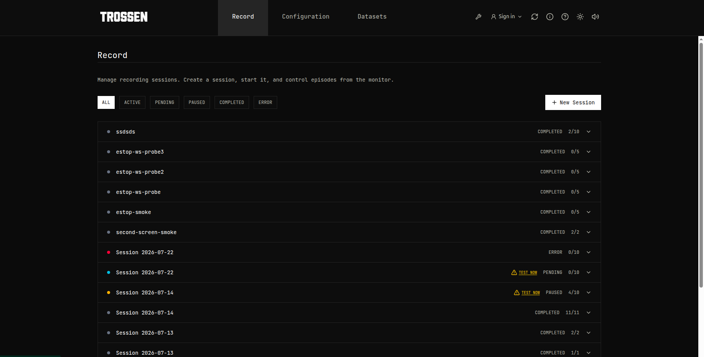

The icons on the right, left to right:

| Icon | What it does |
|------|--------------|
| Wrench | Run a hardware test right now, without leaving the page |
| Sign in | Claim the machine as an operator (optional — see §8) |
| Circular arrow | Update the application to the latest version |
| **i** | Version & status panel — what's installed and whether it's healthy |
| **?** | Replay the guided tour |
| Sun / moon | Switch between light and dark themes |
| Speaker | Mute or unmute the sounds that mark episode start and end |

---

## 2. Learn the app: guided tour and shortcuts

**First time here?** The app offers a one-minute walkthrough that takes you from
connecting hardware to reviewing the finished dataset. It appears on first
visit, and you can replay it any time with the **?** button.

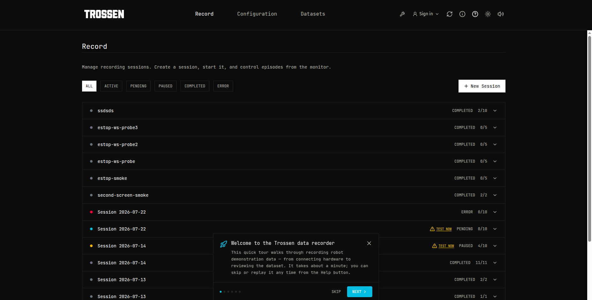

**Prefer the keyboard?** Press **?** on your keyboard for the shortcut sheet.
The important ones: **Space** starts or advances an episode, **S** stops the
session, **R** re-records the current episode, and **Esc** leaves the monitor.

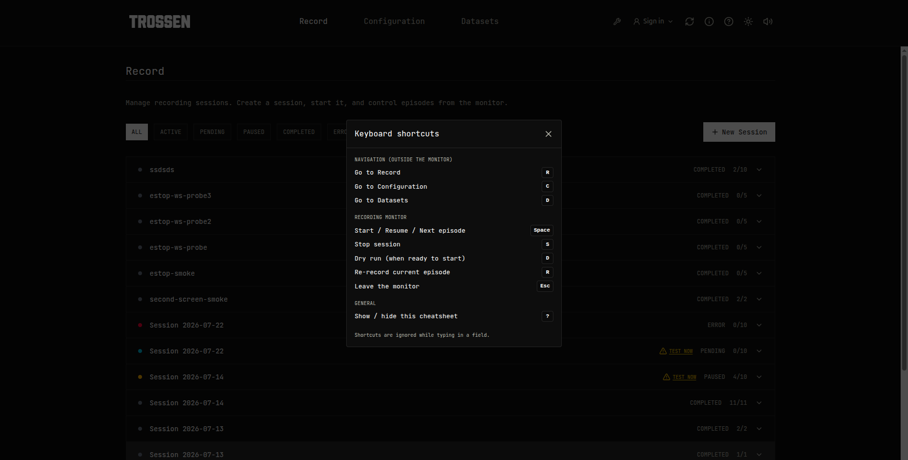

Shortcuts are ignored while you're typing in a text box, so they can't fire by
accident.

---

## 3. Configuration — describe your robot

Open this page first. A **system** is one saved robot setup: which arms, at
which IP addresses, with which cameras.

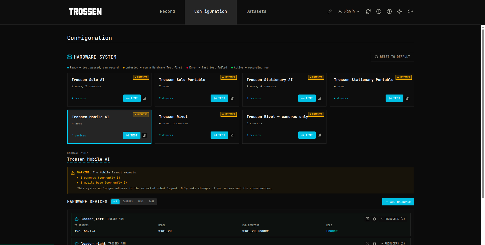

### Pick a starting point

Five systems ship with the app, so you usually don't build one from scratch:

| System | What it is |
|--------|------------|
| **Trossen Solo AI** | 1 leader + 1 follower arm, 2 cameras |
| **Trossen Solo Portable** | Solo with a passive lightweight leader (no motors) |
| **Trossen Stationary AI** | 2 leader + 2 follower arms, 4 cameras |
| **Trossen Stationary Portable** | Stationary with passive lightweight leaders |
| **Trossen Mobile AI** | Bimanual arms, cameras, and a SLATE mobile base |

The **Portable** systems are for the lightweight leader arms that have no
motors — you move them by hand and the follower copies. The app handles the
joint remapping for you; the gripper can optionally push back with force
feedback so you can feel when it closes on something.

### The coloured status dot

Each card is badged so you can see at a glance whether it is safe to record:

- **Ready** — the hardware test passed, you can record.
- **Untested** — run a hardware test first.
- **Error** — the last test failed. Fix it and test again.
- **Active** — this system is recording right now.

Press **TEST** to check every arm, camera, and base the system declares.
Do this before every recording session — it is the single best way to avoid
losing a session halfway through.

### Editing a system

Click the pencil to edit. You'll usually only change **arm IP addresses** and
**camera serial numbers**. The page warns you if a system stops matching its
expected layout (for example a Mobile system with no cameras attached), so a
half-finished edit can't quietly become your recording setup.

Further down, **Hardware Devices** lists every arm, camera, and base
individually. Advanced per-arm settings live here — how fast the arm may move,
how tightly the gripper has to match its target before the app accepts it, and
a small closure adjustment for grippers whose fingers don't quite meet. Leave
these alone unless you have a reason to change them.

---

## 4. Record — create a session

A **session** is one batch of recording: this robot, this task, this many
episodes. Press **+ New Session**.

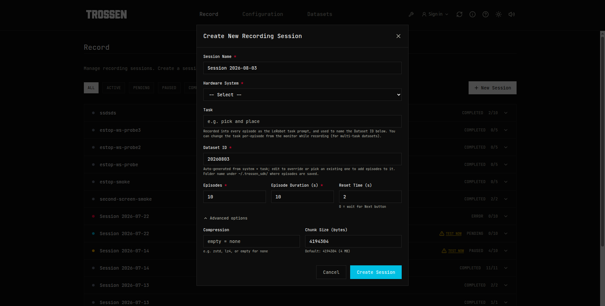

Fill in:

- **Session Name** — anything you'll recognise later. Pre-filled with today's date.
- **Hardware System** — the setup from §3.
- **Task** — plain English, e.g. *pick up the red block*. This matters: it is
  saved into every episode as the instruction the model trains on, and it names
  the dataset for you. You can change it per-episode while recording, which is
  how you build one dataset covering several tasks.
- **Dataset ID** — the folder your episodes go into. Named for you from the
  system, task, and date. Type an existing name here to **add episodes to that
  dataset** instead of starting a fresh one.
- **Episodes** — how many to record.
- **Episode Duration (s)** — how long each one runs.
- **Reset Time (s)** — the pause between episodes, for putting objects back.
  Set it to `0` to wait for you to press Next instead of using a timer.

### Advanced options: making files smaller

Expand **Advanced options** for two storage settings:

- **Compression** — blank means no compression, which is the default. Type
  `zstd` to make recordings roughly **2.5× smaller**, or `lz4` for a smaller
  saving at lower CPU cost. Both are lossless — nothing about the recording
  changes except the file size. On a 32-core machine, `zstd` costs under 10% of
  the CPU and drops no frames.
- **Chunk Size (bytes)** — how much data is compressed at a time. Leave it at
  `4194304` (4 MB).

> **Careful:** this box is free text and is not checked. Typing the word `none`
> is *not* the same as leaving it blank — it is treated as an unknown setting,
> and you'll get full-size uncompressed files with only a warning in the log.
> For no compression, leave the box **empty**.

### Managing sessions in the list

Each row shows its state and progress (`4/10` means four of ten episodes
recorded). Filter with the **ALL / ACTIVE / PENDING / PAUSED / COMPLETED /
ERROR** buttons.

Expand a row for its controls. Besides Start and Resume:

- **Edit Episodes** — change the target episode count, even mid-session. Ask
  for more and it tells you how many are left to record; ask for fewer and the
  session finishes sooner.
- **Delete** — remove the session.

A session that ends in **Error** can be recovered: fix the hardware, clear the
error, run a hardware test, and resume from the episode where it stopped. You
never lose the episodes already recorded.

---

## 5. The monitor — recording, episode by episode

Starting a session opens the monitor. This is where you spend the session.

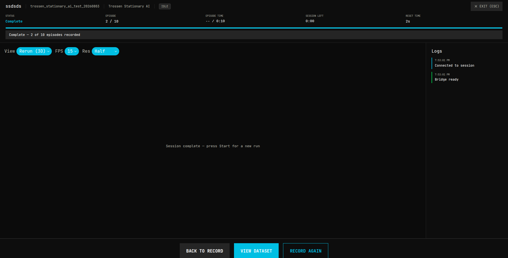

Along the top: status, which episode you're on, time left in the episode, time
left in the session, and the reset countdown. Underneath is the live camera
view, with a log panel on the right.

### Live view controls

Three chips above the video control what you watch and how hard it works:

- **View** — **Rerun (3D)** for the full viewer with 3D robot state, or
  **Lite (Pi)** for a plain image stream that a Raspberry Pi or a slow laptop
  can keep up with.
- **FPS** — 5, 10, 15, or 30. Lower it if the feed stutters.
- **Res** — Full, Half, or Quarter.

These affect **only what you see**. The recording is always full rate and full
resolution, so turning the preview down to save a slow display costs you
nothing in the dataset.

### Controls while recording

- **Start / Resume** — begin, or continue after a pause. (**Space**)
- **Next** — end this episode early and go to the reset pause; press again to
  skip the rest of the pause.
- **Re-record** — throw away the current episode and do it again at the same
  index. Use it the moment something goes wrong; nothing is wasted. (**R**)
- **Stop** — end the session and save it as paused, to resume later. (**S**)
- **Change** (next to the task) — set a different task prompt for the upcoming
  episodes. This is how one dataset ends up covering several tasks.
- **Dry run** — run the whole flow, hardware and all, but write no files.
  Perfect for rehearsing or checking hardware. (**D**)

Teleoperation stays live during the reset pause, so you can reposition the arms
between episodes.

When the session finishes you get **Back to Record**, **View Dataset**, and
**Record Again**.

---

## 6. Datasets — browse what you recorded

Two tabs: **MCAP** for raw recordings, **LEROBOT** for datasets converted for
training. The counts in the tabs tell you how many of each you have.

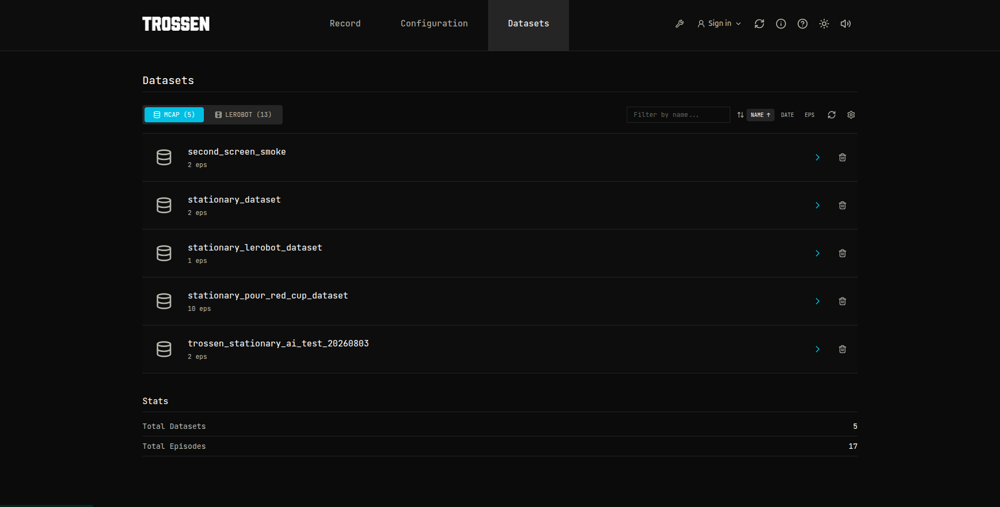

Filter by name, sort by name, date, or episode count, and refresh.

The gear icon sets the two folders the app scans:

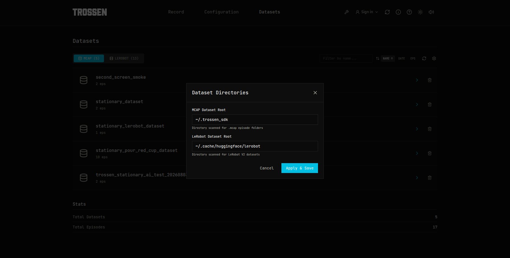

Only change these if you keep data on another drive.

### One dataset in detail

Click a row's arrow for the detail page: where it is on disk, how many episodes,
total size, and every episode file with its own size.

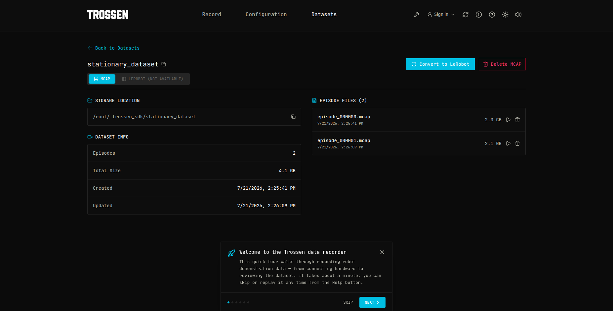

The small **▷** next to an episode plays it back so you can check a recording
before converting. Episodes can be deleted individually, and the whole dataset
with **Delete MCAP**.

If a dataset has already been converted, the **LEROBOT** tab here shows the
converted version alongside the raw one.

---

## 7. Convert to LeRobot

Raw MCAP recordings aren't what you train on — you convert them to a LeRobot
dataset first. Press **Convert to LeRobot** on the detail page.

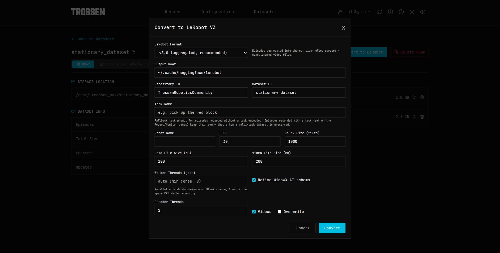

Most of this is pre-filled. What matters:

- **LeRobot Format** — **v3.0 is recommended** and is the default. v2.1 is
  still there for older training setups.
- **Output Root / Repository ID / Dataset ID** — where the result is written.
- **Task Name** — a *fallback* only. Episodes recorded with a task keep their
  own, which is what preserves a multi-task dataset. Leave it blank if every
  episode already has a task.
- **Worker Threads (jobs)** — how many episodes are processed at once. Blank
  means automatic and is the right answer almost always. Lower it if you need
  to spare CPU for something else. **Do not raise it above 8** — higher values
  are known to crash the converter.
- **Native WidowX AI schema** — on by default. Leave it on unless you
  specifically need the older naming.
- **Videos** — encode camera frames into video files. Leave on.
- **Overwrite** — replace an existing conversion instead of failing.

Press **Convert** and a live log appears. Conversion is CPU-heavy and takes a
while on big datasets; you can leave the page and come back.

For what the output actually contains, see the
[conversion guide](../scripts/README.md).

---

## 8. Housekeeping: version, updates, operators

### What's installed, and is it healthy?

The **i** button reports the frontend, backend, and SDK versions, plus two
things worth checking before a long session: whether **live feeds** are ready
and whether the **converter** is built.

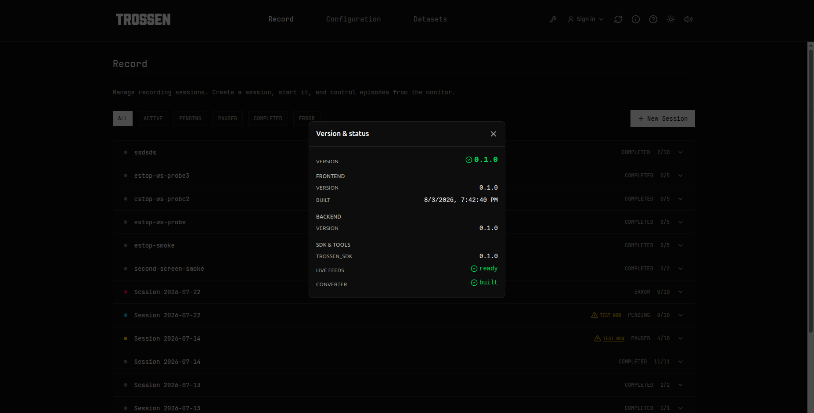

### Updating

The circular-arrow button updates the app in place and asks for confirmation
first. It's disabled while a hardware test is running.

### Operators (optional)

If your site runs the fleet hub, **Sign in** claims the machine under your name
so recordings are attributed and downtime is tracked. Sign in with your name and
PIN. On a standalone machine you can ignore this entirely. See
[hub/README.md](hub/README.md).

---

## 9. Where your data lives

Nothing is stored inside the containers, so recordings survive a rebuild.

| Folder on your machine | What's in it |
|------------------------|--------------|
| `~/.trossen_sdk/` | Raw MCAP recordings, one folder per dataset |
| `~/.cache/huggingface/lerobot/` | Converted LeRobot datasets |
| `~/.config/trossen_sdk_webapp/` | Your saved hardware systems |
| `~/.local/state/trossen_sdk_webapp/` | Sessions and settings database |

---

## Quick answers

**Which compression should I use?** `zstd`. Roughly 2.5× smaller, lossless, and
cheap on a multi-core machine. Leave the box empty for none — never type `none`.

**Which LeRobot format?** v3.0, the default.

**My live view is choppy.** Lower **FPS** and **Res** in the monitor, or switch
**View** to **Lite (Pi)**. The recording is unaffected.

**I ruined an episode.** Press **Re-record** (or **R**). It is discarded and
re-recorded at the same index.

**I need more episodes than I asked for.** **Edit Episodes** on the session row.

**One dataset, several tasks?** Use **Change** next to the task in the monitor
between episodes. Each episode remembers its own task, and conversion preserves
them.

**Can I test without saving anything?** **Dry run** — the full flow, no files.
